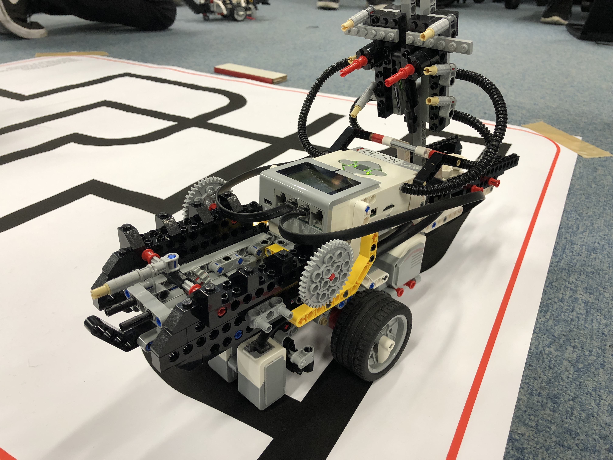

# LegoMS
B3ST 知能ロボット演習のLegoMS演習

## 概要
LEGO Mindstorms EV3の演習で使用したプログラムソース

## Picture

## Movie

## About Branch
### main
**リリース版** 最終バージョン（葉っぱカーブでGoal判定になってゴールならず・・・）

### feature
**beta版** 爆速化max250で突破可能（なはず）

### develop
さらに爆速化max300したが、どこをどうしたのか訳わからなくなったので無視．

### develop_2
新developブランチ．すでにmainにマージ済み．

## 実行ファイルの区別
### main.py

### main_stable.py

### main_stable_ex.py

### main_final.py

## 工夫点
1. プログラム管理上の工夫
    - Git & GitHubを使用したバージョン管理
        - バージョン管理によってstableなバージョンを取り出すことができたので本番前に問題が起こった時に参照できた
    - マジックNoをなるべく回避するプログラム
        - まだ実行部にマジックナンバーが若干いるが、なるべく減らすよう心がけた
    - レイヤを分けた実装
        - `detect_black`を別に抽出することで、層を分けた実装にするよう心がけた
2. アルゴリズム上の工夫
    - 

## 反省点
1. 低レイヤー（センサー値の取り扱い、`detect_black`）に関して、**動作プログラムを記述するよりも前の、もっと早い段階**で高い性能を達成しているべきだった
    - 黒か白かの判別がきちんとできる前提でプログラムが組んであるので、`detect_black`の品質がメインのプログラムを大きく左右することになる
    - （ネットワークのOSI参照モデルにおける物理層の品質を担保することが大事なように）
    - 一度低レイヤーをきっちり定義した後、変更を加える時には、全ての動作のテストを行えるだけの時間的余裕を確保しておくべき、それが無理なら変更しない方が吉かもしれない
2. 状態遷移を含むようなプログラムの場合は**実行時にデバッグしやすいよう**に、どの状態にいるのかをきちんと視覚的（色・display出力・log）を表示するべきだった
    - 変な挙動をした時にどこからどこに遷移しているのかが結局わからなかった
    - 似たような動作(`robot.drive`の動作)が複数存在するからこそ、遷移先がわかれば遷移条件をもっと詳しく検討できた

3. 速度に応じて変数を束縛しておいた方がやりやすい？（自由なのでわからないけど）
    - 機体速度(normal, slow, take_care)に応じたwaitの時間を設定する必要があった．
    - waitの時間は機体速度が変更になったら自動で変更可能なようにした方が良いかなと思った．

## 問題点
0. **[センサの閾値が決まらない問題]** センサの値をprintしてログして検討
1. **[カーブで行きすぎる問題]**
    - mainのwhileのwaitを短く→ カーブ制御（）の中身にあるwaitを短く
    - 曲がる角度を変えてもよかったのでは？？？
2. **[異常値で全部白を迎えると角度を換えられる問題]**
    1) detect_blackのなかで二度センサ値を確かめる処理
    2) if(last_detected == L(orR))の後のrobot_driveをwhile(!L&!C&!R)で包む
3. **[何らかの原因で斜めに十字路に差し掛かった時に終了条件を満たせず直進し続けてしまう]**
    1) 十字路だったときの条件をCのセンサだけに緩和 & 左右にずれたときの角度調整もする（!C&Rを検知してたらspeed0で左に振る、!C&Lを検知してたら右に振る、複数回試行してダメだったらflag立てて終了？）
    2) スピードをtake_careに落とす

99. **[到着時の音楽が一生決まらない問題]** 助けてください．

## Link
- [講義ページ](https://www.katolab.nitech.ac.jp/lecture/intelli-robot/lego/index.html)

- [ルール一覧](https://www.katolab.nitech.ac.jp/lecture/intelli-robot/lego/rule2016/)